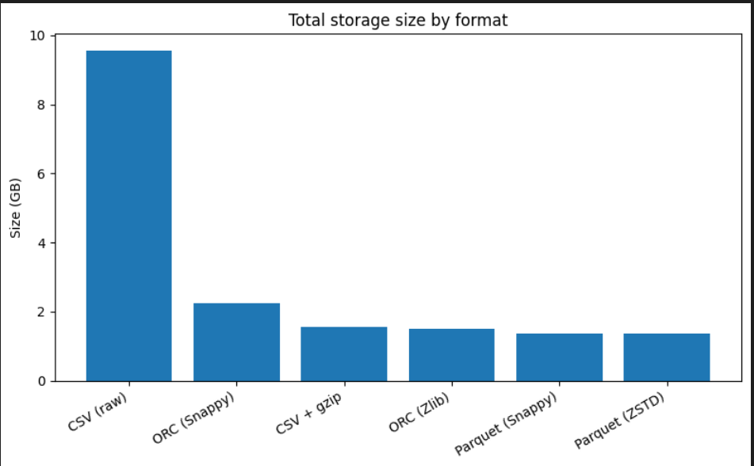
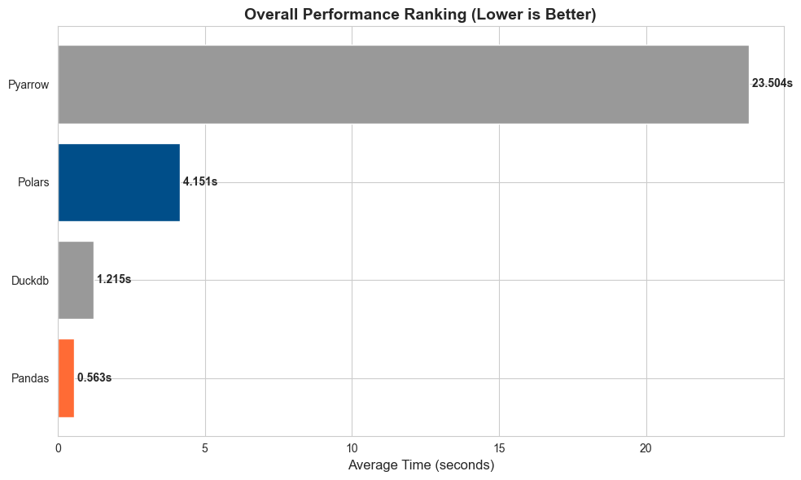
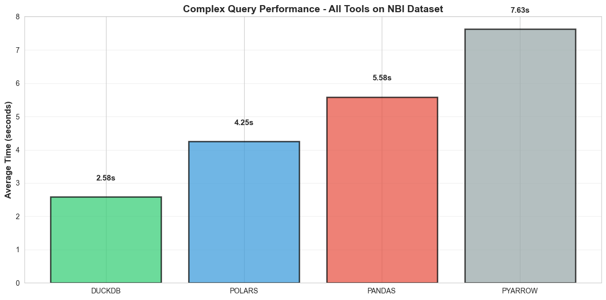

# Comparative Analysis of Data Storage Formats and Query Performance for Large-Scale National Bridge Inventory (NBI) Datasets

## Abstract

The National Bridge Inventory (NBI) Data Format Analysis Project evaluates the efficiency of various data storage formats and query tools for managing large-scale infrastructure data. The project utilizes a dataset comprising 21.6 million total rows across 1,728 files, totaling approximately 1.4 GB. To determine the most efficient method for handling this data, the project converts the NBI dataset into multiple compressed formats: CSV with GZIP, ORC with Snappy, and Parquet with both Snappy and Zstandard. This paper investigates storage efficiency, compression ratios, and the query performance of four major Python-based tools—DuckDB, Pandas, Polars, and PyArrow—to identify the optimal workflow for large-scale bridge data analysis.

## Introduction
Efficient data storage and retrieval are critical for managing the vast datasets associated with national infrastructure. While traditional formats like CSV are widely used, they often lack the performance required for complex analytical tasks. This study seeks to identify the "best" format by comparing traditional row-based storage with modern columnar formats like Parquet and ORC. Initial findings suggest that while there is no single "best" format for every scenario, Parquet combined with specialized query engines offers the most robust performance for complex multi-column aggregations.

## Background
The National Bridge Inventory (NBI) represents a massive repository of structural data that requires frequent querying for maintenance and safety assessments. As these datasets grow, the overhead of standard Python tools becomes a bottleneck. Columnar storage formats (Parquet, ORC) and optimized query engines (DuckDB, Polars) have emerged as solutions to these performance challenges by implementing features like predicate pushdown and lazy evaluation.

## Methodology
The research methodology involved three distinct phases: conversion, validation, and benchmarking.
Data Conversion: Raw NBI data was converted using Python 3.8+ scripts into compressed formats, specifically CSV (GZIP), ORC (Snappy), Parquet (Snappy), and Parquet (Zstandard).
Validation: Automated scripts were used to ensure the integrity of the converted outputs across all formats.

 

Fig 1: Storage Tool Comparison with csv

Benchmarking: Four tools were tested against the Parquet dataset:
Pandas: Eager evaluation with no optimization.
DuckDB: SQL query planner utilizing predicate pushdown.
Polars: Utilizing lazy evaluation for deferred execution.
PyArrow: Utilizing the Dataset API with filter pushdown.
Two query scenarios were tested: Simple Queries (1 column, basic aggregation) and Complex Queries (12 columns, multi-level aggregation with filtering and grouping).

## Results
The benchmarking results revealed a clear distinction in performance based on query complexity:

 | Scenario              | Winner | Time (s) | Key Advantage                                 |
  |-----------------------|--------|----------|----------------------------------------------|                                                               
  | Simple Query          | Pandas | 0.547    | Low optimization overhead                    |
  | Complex Query         | DuckDB | 2.257    | SQL planner + predicate pushdown             |                                                               
  | Lazy Evaluation       | Polars | 4.126    | Better than eager loading                    |
  | Dataset API           | PyArrow| 7.762    | 80% improvement with optimization            |

  

Fig 2 : Simple Query Results

  

Fig 3: Complex Query Results

## Discussion
The analysis highlights that query type is the primary determinant of performance.
Simple Scenarios: Pandas remains the fastest for simple, single-column operations because it avoids the overhead of query planning and optimization.

Complex Scenarios: DuckDB is the clear winner for multi-column, multi-level aggregations due to its sophisticated SQL planner and ability to push filters down to the storage layer (predicate pushdown).
Data Quality Constraints: It is important to note that these results were obtained using raw, uncleaned NBI data. Performance was impacted by type inconsistencies, such as mixed Int64 and Float64 types, and missing values. Cleaned production data might yield different absolute performance metrics.

## Conclusion
This project demonstrates that for large-scale infrastructure datasets like the NBI, DuckDB paired with Parquet storage provides the most efficient performance for complex analytical queries. However, for lightweight tasks, the simplicity of Pandas remains effective. Future work will focus on implementing and benchmarking the AVRO format, which is currently in development (WIP), and testing these tools on fully cleaned datasets to further refine performance recommendations